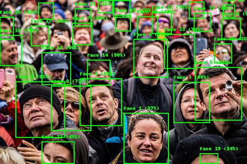

## Usage

```
$ python3 detect_face.py [-h] -i IMAGE_PATH -o OUTPUT_PATH [-r MAX_RESULTS]
```

## Example

Image: `woman_yelling.jpg` (Source image: [knowyourmeme.com](https://knowyourmeme.com/memes/woman-yelling-at-a-cat))

```
$ python3 detect_face.py -i images/woman-yelling.jpg -o output/woman-yelling_out.jpg
```


Image: `human-crowd.jpg` (Source image: [gilesmeetsworld.com](https://gilesmeetsworld.com/how-to-avoid-crowds-when-you-travel/))


```
$ python3 detect_face.py -i images/crowd.jpg -o output/crowd_out.jpg -r 30
```



