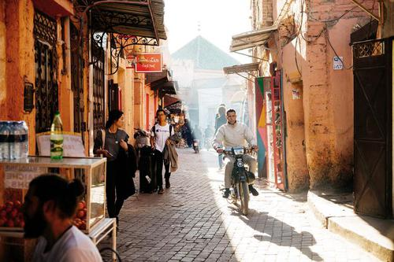

## Usage

```
$ python3 detect_labels.py [-h] -i SOURCE_IMAGE [-r MAX_RESULTS]
```

## Example

Image: `sports.jpg` (Source image: [format.com](https://www.format.com/magazine/features/photography/sports-photographers))


```
$ python3 detect_labels.py -i images/sports.jpg
```

Output:

```
Detecting labels from sports.jpg... found 5 labels

Player (99% confidence)
Football player (97% confidence)
Soccer player (95% confidence)
Games (94% confidence)
Tackle (94% confidence)
```

Image: `street.jpg` (Source image: [langly.co](https://www.langly.co/blogs/resources/street-photography-tips-for-the-adventure-photographer))



```
$ python3 detect_labels.py -i images/street.jpg -r 8 
```

Output:
```
Detecting labels from street.jpg... found 8 labels

Street (94% confidence)
Alley (90% confidence)
Town (90% confidence)
Road (82% confidence)
Infrastructure (78% confidence)
Building (71% confidence)
City (67% confidence)
Neighbourhood (66% confidence)
```