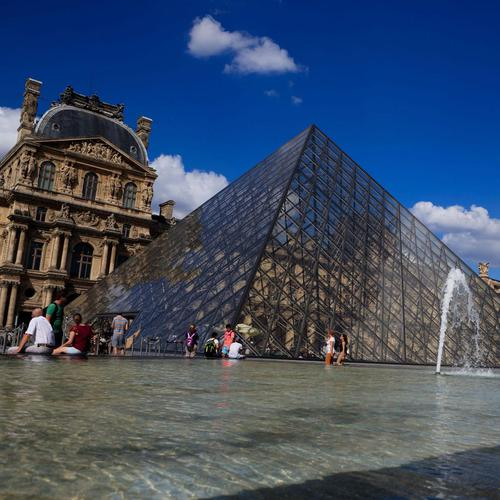
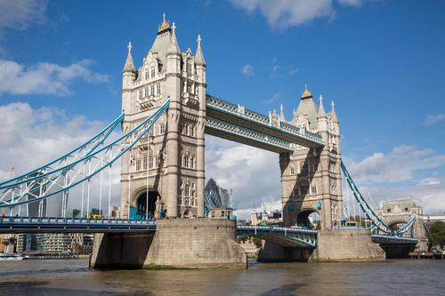

## Usage

```
$ python3 detect_labels.py [-h] -i SOURCE_IMAGE [-r MAX_RESULTS]
```

## Example

Image: `louvre.jpg` (Source image: [manchestereveningnews.co.uk](https://www.manchestereveningnews.co.uk/whats-on/whats-on-news/can-you-name-iconic-landmarks-18218766))



```
$ python3 detect_landmark.py -i images/louvre.jpg
```

Output:

```
Detecting landmark from louvre.jpg...

Louvre (79% confidence)
    Bounds    : (70,141), (387,141), (387,273), (70,273)
    Latitude  : 48.861013
    Longitude : 2.335818
The Louvre (26% confidence)
    Bounds    : (113,127), (344,127), (344,169), (113,169)
    Latitude  : 48.860881
    Longitude : 2.335538
```

Image: `tower_bridge.jpg` (Source image: [iicom.org](https://www.iicom.org/wp-content/uploads/London-Dec-2018.jpg))



```
$ python3 detect_labels.py -i images/tower_bridge.jpg
```

Output:
```
Detecting landmark from tower_bridge.jpg...

Tower Bridge (85% confidence)
    Bounds    : (113,93), (386,93), (386,219), (113,219)
    Latitude  : 51.505778
    Longitude : -0.075982
Tower Bridge (30% confidence)
    Bounds    : (160,0), (400,0), (400,219), (160,219)
    Latitude  : 51.506124
    Longitude : -0.07523
```