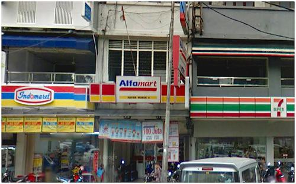
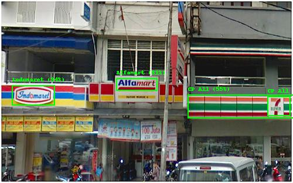

## Usage

```
$ python3 detect_logo.py [-h] -i IMAGE_PATH -o OUTPUT_PATH [-r MAX_RESULTS]
```

## Example

Image: `minimarket.jpg` (Source image: [bareksa.com](https://www.bareksa.com/berita/berita-ekonomi-terkini/2014-08-04/alfamart-amrt-tingkatkan-pendapatan-dari-bisnis-e-commerce))

```
$ python3 detect_logo.py -i images/minimarket.jpg -o output/minimarket_out.jpgg
```





Image: `menchies.jpg` (Source image: [agcsigns.com](https://agcsigns.com/blog/should-a-company-building-sign-include-their-tagline))


```
$ python3 detect_logo.py -i images/menchies.jpg -o output/menchies_out.jpg
```


