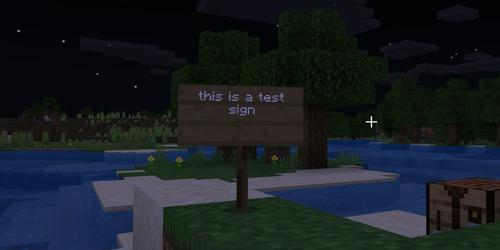

## Usage

```
$ python3 detect_logo.py [-h] -i IMAGE_PATH -o OUTPUT_PATH [-r MAX_RESULTS]
```

## Example

Image: `minecraft-sign.jpg` (Source image: [addictivetips.com](https://www.addictivetips.com/windows-tips/change-text-color-for-signs-in-minecraft/))

```
$ python3 detect_text.py -i images/minecraft_sign.jpg -o output/minecraft_sign_out.jpg
```




```
Detecting text from minecraft_sign.jpg... found 21 characters

Text detected : 'this is a test\nsign\n+'

Writing output image to output/minecraft_sign_out.jpg... Done
```

Image: `sign.jpg` (Source image: [abcactionnews.com](https://www.abcactionnews.com/news/driving-tampa-bay-forward/hillsborough-county-wants-to-know-about-missing-or-vandalized-traffic-signs))


```
$ python3 detect_text.py -i images/sign.jpg -o output/sign_out.jpg
```


```
Detecting text from sign.jpg... found 12 characters

Text detected : 'ONE WAY\nSTOP'

Writing output image to output/sign_out.jpg... Done
```