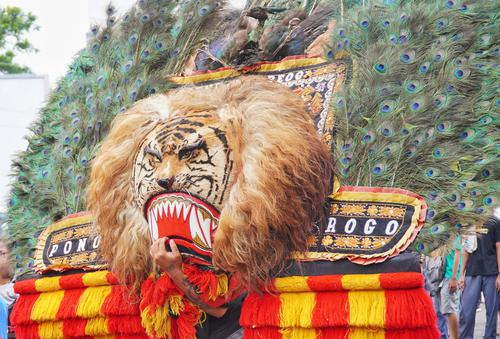

## Usage

```
$ python3 safe_search.py [IMAGE_PATH]
```

## Example

File: `reog.jpg` (Source image: [wikiwand](https://www.wikiwand.com/id/Reog_(Ponorogo)))



```
$ python3 detect_web.py reog.jpg
```

Output:
```
Detecting web entities and pages from reog.jpg...

Best guess label: reog ponorogo

Web entities found:
- Ponorogo Regency (Score: 0.81)
- Reog (Score: 0.73)
- Singo Barong (Score: 0.67)
...

Full Matches found:
- Url: https://upload.wikimedia.org/wikipedia/commons/e/e3/Reog_Ponorogo_-_Singo_Barong.jpg
- Url: https://pariwisataindonesia.id/wp-content/uploads/2020/10/Reog_Ponorogo_-_Singo_Barong-foto-by-wikiwand.com_-1600x1087.jpg
- Url: https://www.madiunpos.com/files/2020/06/Dadak-merak-Ponorogo.jpg
...

Partial Matches found:
- Url: https://www.poskata.com/wp-content/uploads/2020/09/000020-00_cerita-asal-usul-reog-ponorogo_reog-ponorogo_800x450_ccpdm-min.jpg
- Url: https://i0.wp.com/ytimg.googleusercontent.com/vi/NITD3EKkoLg/mqdefault.jpg
- Url: https://i.ytimg.com/vi/8mUvXyyQX-8/hqdefault.jpg
...

Pages with matching images:
- Url: https://en.wikipedia.org/wiki/Reog
- Url: https://www.wikiwand.com/en/Reog
- Url: https://id.wikipedia.org/wiki/Reog_(Ponorogo)
...

Similar images found:
- Url: https://i.ytimg.com/vi/NyszP9IpaUA/maxresdefault.jpg
- Url: https://img.playes.net/2020/09/14/670950-img0.png?x-oss-process=style%2Ffull
- Url: http://www.inditourist.com/img/201510/large/reogponorogo.JPG
```