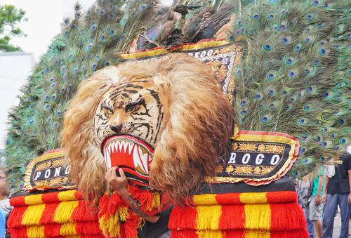

## Usage

```
$ python3 detect_web.py [-h] -i SOURCE_IMAGE [-r MAX_RESULTS]
```

## Example

Image: `reog.jpg` (Source image: [wikiwand](https://www.wikiwand.com/id/Reog_(Ponorogo)))



```
$ python3 detect_web.py -i images/reog.jpg -r 3
```

Output:
```
Detecting web entities and pages from reog.jpg... best guess label: reog ponorogo

Web entities found:
    Ponorogo Regency (Score: 0.78)
    Reog (Score: 0.73)
    Singo Barong (Score: 0.70)

Full Matches found:
    Url: https://upload.wikimedia.org/wikipedia/commons/e/e3/Reog_Ponorogo_-_Singo_Barong.jpg
    Url: https://pariwisataindonesia.id/wp-content/uploads/2020/10/Reog_Ponorogo_-_Singo_Barong-foto-by-wikiwand.com_-1600x1087.jpg
    Url: https://pariwisataindonesia.id/wp-content/uploads/2020/10/Reog_Ponorogo_-_Singo_Barong-foto-by-wikiwand.com_-1280x870.jpg

Partial Matches found:
    Url: https://pariwisataindonesia.id/wp-content/uploads/2020/10/Reog_Ponorogo_-_Singo_Barong-foto-by-wikiwand.com_-280x210.jpg
    Url: https://blue.kumparan.com/image/upload/fl_progressive,fl_lossy,c_fill,q_auto:best,w_640/v1594969747/iiacaelqrwacjn3z5z8o.jpg
    Url: https://blue.kumparan.com/image/upload/fl_progressive,fl_lossy,c_fill,q_auto:best,w_480,f_jpg/iiacaelqrwacjn3z5z8o.jpg

Pages with matching images:
    Url: https://commons.wikimedia.org/wiki/File:Reog_Ponorogo_-_Singo_Barong.jpg
    Url: https://id.wikipedia.org/wiki/Reog_(Ponorogo)
    Url: https://id.m.wikipedia.org/wiki/Berkas:Reog_Ponorogo_-_Singo_Barong.jpg

Similar images found:
    Url: https://upload.wikimedia.org/wikipedia/commons/thumb/e/e3/Reog_Ponorogo_-_Singo_Barong.jpg/220px-Reog_Ponorogo_-_Singo_Barong.jpg
    Url: https://www.poskata.com/wp-content/uploads/2020/09/000020-00_cerita-asal-usul-reog-ponorogo_reog-ponorogo_800x450_ccpdm-min.jpg
    Url: https://img.playes.net/2020/09/14/670950-img0.png?x-oss-process=style%2Ffull
```