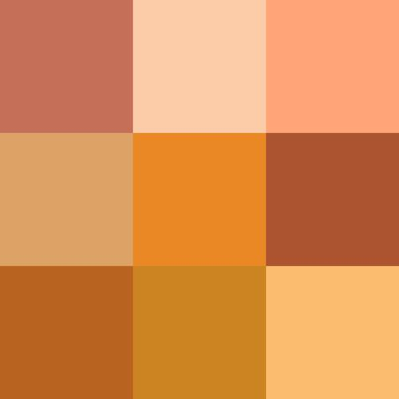

## Usage

```
$ python3 image_properties.py [-h] -i SOURCE_IMAGE
```

## Example

Image: `xps.jpg` (Source image: [unsplash.com](https://unsplash.com/photos/2L-0vnCnzcU))


```
$ python3 image_properties.py -i images/xps.jpg
```

Output:
```
Detecting image properties from xps.jpg...

Dominant Colors:
#c9ccc5 (25.3% coverage)
#dfe8e4 (18.2% coverage)
#a0a19a (15.4% coverage)
#151713 (6.0% coverage)
#dcc3a3 (2.0% coverage)
#ccebe5 (1.9% coverage)
#eddbb8 (1.3% coverage)
#dab8a9 (0.3% coverage)
#bfa48f (0.2% coverage)
#d9c293 (0.1% coverage)
```

Image: `wikipedia.org` (Source image: [wikipedia.org](https://en.wikipedia.org/wiki/Shades_of_orange#/media/File:Color_icon_orange_v2.svg))



```
$ python3 image_properties.py -i images/shades.jpg
```

Output:
```
Detecting image properties from shades.jpg...

Dominant Colors:
#b86043 (21.9% coverage)
#cc8422 (11.7% coverage)
#ffc77c (10.9% coverage)
#ffa478 (10.9% coverage)
#b86320 (10.9% coverage)
#ea8825 (10.7% coverage)
#dda266 (10.3% coverage)
#fbcba7 (10.2% coverage)
#ca851f (0.3% coverage)
#d47926 (0.2% coverage)
```