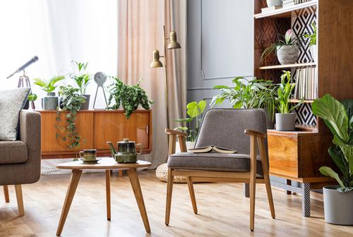
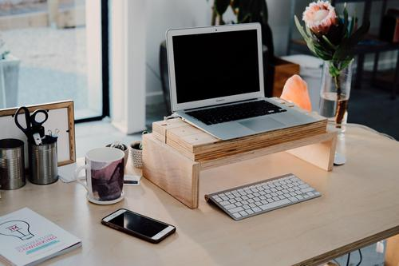

## Usage

```
$ python3 object_localizataion.py [-h] -i SOURCE_IMAGE [-r MAX_RESULTS]
```

## Example

Image: `furniture.jpg` (Source image: [hgtv.ca](https://assets.blog.hgtv.ca/wp-content/uploads/2019/11/28103558/Place-Your-Plants-According-to-Their-Needs1.jpg))



```
$ python3 object_localization.py -i images/furniture.jpg
```

Output:
```
Detecting objects from furniture.jpg... found 5 objects

Flowerpot (76% confidence)
Plant (75% confidence)
Chair (73% confidence)
Furniture (69% confidence)
Coffee table (67% confidence)
```

Image: `furniture.jpg` (Source image: [hgtv.ca](https://assets.blog.hgtv.ca/wp-content/uploads/2019/11/28103558/Place-Your-Plants-According-to-Their-Needs1.jpg))



```
$ python3 object_localization.py -i images/desk.jpg -r 10 
```

Output:
```
Detecting objects from desk.jpg... found 7 objects

Laptop (95% confidence)
Computer keyboard (90% confidence)
Mobile phone (82% confidence)
Computer keyboard (68% confidence)
Furniture (61% confidence)
Desk (58% confidence)
Mug (56% confidence)
```